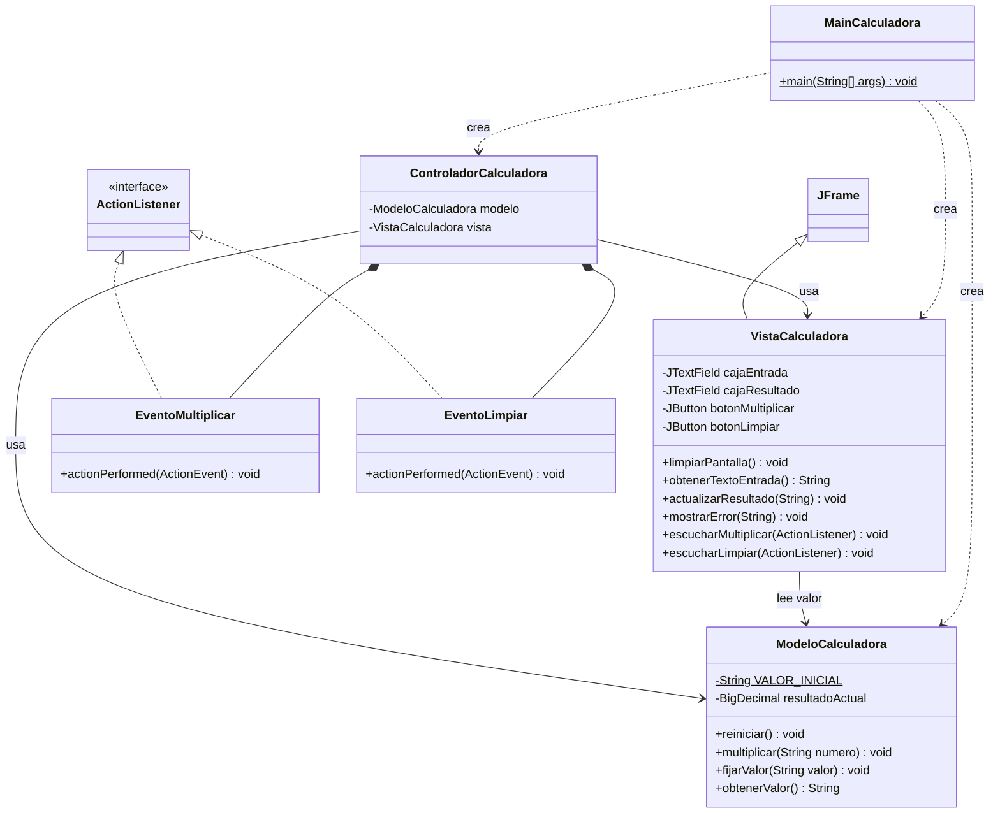

## 2.1 Diagrama anterior

```mermaid
classDiagram
    class MainCalculadora {
        +main(String[] args)$ void
    }
    class ModeloCalculadora {
        -String VALOR_INICIAL$
        -BigDecimal resultadoActual
        +reiniciar() void
        +multiplicar(String numero) void
        +fijarValor(String valor) void
        +obtenerValor() String
    }
    class VistaCalculadora {
        -JTextField cajaEntrada
        -JTextField cajaResultado
        -JButton botonMultiplicar
        -JButton botonLimpiar
        +limpiarPantalla() void
        +obtenerTextoEntrada() String
        +actualizarResultado(String) void
        +mostrarError(String) void
        +escucharMultiplicar(ActionListener) void
        +escucharLimpiar(ActionListener) void
    }
    class ControladorCalculadora {
        -ModeloCalculadora modelo
        -VistaCalculadora vista
    }
    class EventoMultiplicar {
        +actionPerformed(ActionEvent) void
    }
    class EventoLimpiar {
        +actionPerformed(ActionEvent) void
    }
    class JFrame
    class ActionListener {
        <<interface>>
    }
    JFrame <|-- VistaCalculadora
    ActionListener <|.. EventoMultiplicar
    ActionListener <|.. EventoLimpiar
    ControladorCalculadora *-- EventoMultiplicar
    ControladorCalculadora *-- EventoLimpiar
    ControladorCalculadora --> ModeloCalculadora : usa
    ControladorCalculadora --> VistaCalculadora : usa
    VistaCalculadora --> ModeloCalculadora : lee valor
    MainCalculadora ..> ModeloCalculadora : crea
    MainCalculadora ..> VistaCalculadora : crea
    MainCalculadora ..> ControladorCalculadora : crea
```
